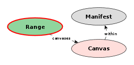

# Canvas cutouts spanning Manifests

The [Center for Open Data in the Humanities](http://codh.rois.ac.jp/) proposes a [*Curation* extension](http://codh.rois.ac.jp/iiif/curation/) for the IIIF Presentation API that makes it possible to bundle parts of Canvases across multiple Manifests ([demo](http://codh.rois.ac.jp/iiif/iiif-curation-viewer/index.html?curation=/software/iiif-curation-viewer/sample/curation.json&pos=8&lang=en)).

Because the question of how such a Curation is different from an AnnotationList seems to come up frequently ― and in part inspired by Tom Crane's article [Looking up and looking down: IIIF Resources, Intellectual Objects, and Units of Distribution](http://resources.digirati.com/iiif/an-introduction-to-iiif/looking-up-and-down.html) ― I want to discuss *Canvas cutouts spanning Manifests* as a useful unit of distribution in IIIF.

(Also, the notion that Curations basically are AnnotationLists is super tempting a first glance and once I had the thought in my head I needed think about and write this down for some peace of mind. Spoiler alert: gladly, I think Curations are not reinventing the wheel.)

## Units of distribution

The IIIF Presentation API appears to be built on the idea of the Manifest as *the* unit of distribution. Nevertheless there are several elements within the specification that more or less clearly fit to describe objects of interest other than the typical physical unit (e.g. a book) and it might be argued that these can be useful units of distribution too.

The table below lists several units of distribution and how they can be described as well as viewed. While *A set of (parts of) pages* already comes with a bit of technical ambiguity (could be described by a Range, AnnotationList or even Annotation) the last column really seems to hit a spot that the Presentation API does not cover.

| Unit | Presentation API description | Viewing software |
| ---- | --------------------------------- | ---------------- |
| Document | `Manifest` | [several](https://github.com/IIIF/awesome-iiif#image-viewers) |
| Collection of documents | `Collection` | ?[b] |
| Detail on a page | `Annotation`[a] | ?[b] |
| One page | `Canvas`[a] | ?[b] |
| A set of (parts of) pages | `Range`[a] | ?[b] |
| A set of (parts of) pages from several documents | `?` | ?[b] |

[a] assuming use of a `within` link pointing to a `Manifest`  
[b] suggests a dedicated viewers vs. multi purpose viewers debate (out of scope here)

Bringing the task *A set of (parts of) pages from several documents* into the IIIF Presentation world we get *A set of Canvas[es/ parts], spanning multiple Manifests*.

## A set of Canvas parts, spanning multiple Manifests

To analyse how to best represent this, staying as close to the Presentation API as possible without misusing elements, let's look at it bit by bit.

### 1. ... Canvas parts ...

Selecting part of a Canvas can be done with the `xywh` URI fragment or a SvgSelector. Both are defined in the [Open Annotation](http://www.openannotation.org/spec/core) and later [Web Annotation](https://www.w3.org/TR/annotation-model) Data Model and their use in IIIF is specified in the Presentation API. The table below lists relevant details.

| selector | selection area | Image API translatable | available for |
| -------- | -------------- | ---------------------- | -------------- |
| \#xywh | rectangular | ✔ | `Range ―canvases―▸` `Annotation ―on―▸` |
| SvgSelector | arbitrary | ✗ | `Annotation ―on―▸` |

### 2. A set of ...

* `Range ―canvases―▸` points at a list by definition (`sc:hasCanvases rdfs:range rdf:List`).
* `Annotation ―on―▸`: [Open](http://www.openannotation.org/spec/core/core.html#BodyTarget)/[Web](https://www.w3.org/TR/annotation-model/#web-annotation-principles) Annotations can have multiple targets. Alternatively the `AnnotationList` parent element may be used.

### 3. ..., spanning multiple Manifests

Depending on where we place the necessary `within` link we get different levels of granularity (if we, for example, let a `Range` point to a Manifest we only need one `within` link per Manifest we reference but loose some freedom in how we can order our set of Canvas parts).

| granularity | link |
| ----------- | ---- |
| per `Manifest` | `Range ―within―▸ Manifest` |
| per `Canvas` | `Range ―canvases―▸ Canvas ―within―▸ Manifest` `Annotation ―on―▸ Canvas ―within―▸ Manifest` |

## Candidates

These all seem sensible and all have their advantages and drawbacks.

| root element | description | image | discussion |
| ------------ | ----------- | ----- | ---------- |
| `Annotation` | One `Annotation` defining multiple `Canvas`es as targets, each `Canvas` points to its `Manifest`. |  | - existing element - possibility to use SvgSelector |
| `AnnotationList` | An `AnnotationList` of `Annotation`s, each pointing at a `Canvas` pointing to its `Manifest`. |  | - existing element - possibility to use SvgSelector |
| `Range` | A `Range` pointing at `Canvas`es, each pointing to its `Manifest`. |  | - existing element - `Range` is conceptualized as a stuctural element (as opposed to `Annotation[List]`) |
| `Curation` | A new element `Curation` that is a collection of `Range`s, each pointing at a `Manifest` as well as the selected `Canvas`es. |  | - new element - `Range` is conceptualized as a stuctural element (as opposed to `Annotation[List]`) - allows following reccomended `Range` URI pattern - direct reuse of `Range`s when restrictively orderd - quite verbose when freely ordered |

### The case for the Curation

* while SvgSelectors give more freedom, selecting rectangular parts is good enough for curators
* `#xywh` selections also work in the IIIF Image API
* using a `Range` seems like the more straightforward choice for describing a structure (set) ― compared to an `Annotation[List]`
* when using `Range` as the root element, the [recommended URI pattern](http://iiif.io/api/presentation/2.1/#range) (which includes the document's `{identifier}`) can not be used
* when a Curation is strictly ordered (i.e. [Range with all Canvas parts from Manifest A], [Range w. all Canv. p. f. Manifest B], ...) and a Manifest's publishing institution deems the Curation's respective Range useful, it could be directly moved into the Manifest

## Open questions

* Annotations
    * when a Manifest includes Annotations (apart from `images`) to be displayed on the Canvas part a Curation selects, should a viewer displaying the Curation view those Annotations?
* (surely many more)

---

### [Comments](https://github.com/IllDepence/iiif-notes/issues/1)
